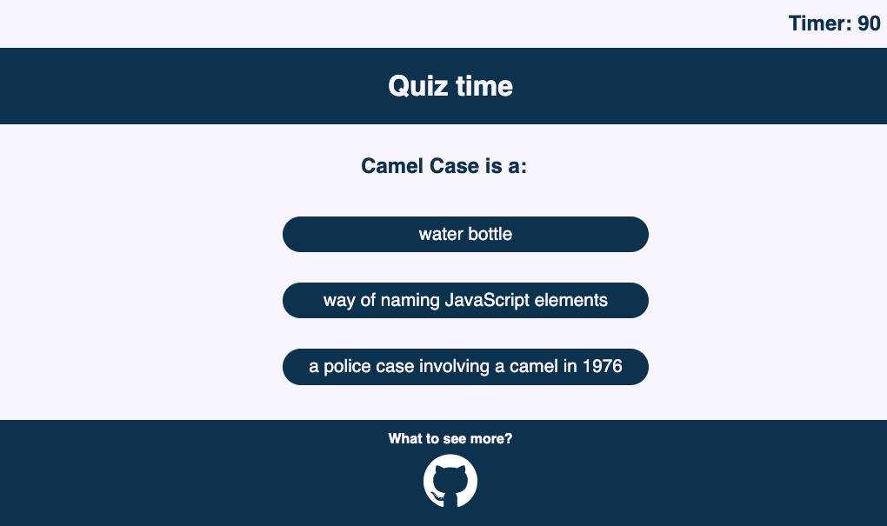
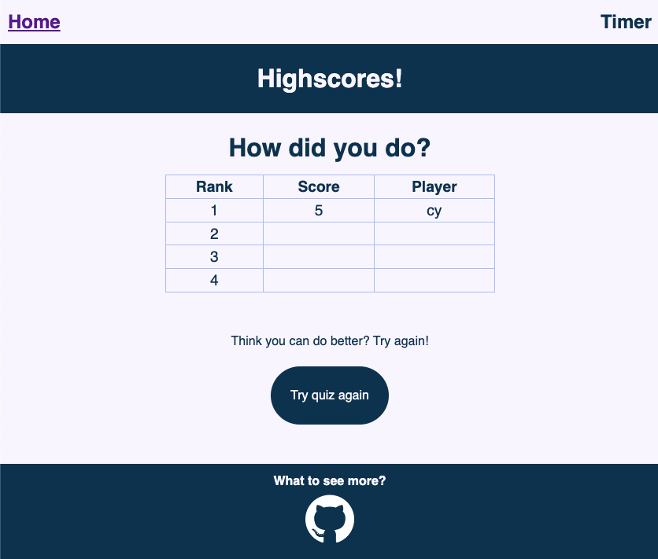

# Caoimhoot
Module 4 challenge - due December 2022 

## User Story and Acceptance Criteria provided for Project

### User Story
- AS A coding boot camp student
- I WANT to take a timed quiz on JavaScript fundamentals that stores high scores
- SO THAT I can gauge my progress compared to my peers

### Acceptance Criteria
- GIVEN I am taking a code quiz
- WHEN I click the start button
- THEN a timer starts and I am presented with a question
- WHEN I answer a question
- THEN I am presented with another question
- WHEN I answer a question incorrectly
- THEN time is subtracted from the clock
- WHEN all questions are answered or the timer reaches 0
- THEN the game is over
- WHEN the game is over
- THEN I can save my initials and my score

## Description
### What was your motivation?
To produce a quiz game for JavaScript. 

### Why did you build this project?
This quiz game was built to further cement my lerarning in JS and Web APIs. 

### What problem does it solve?

### What did you learn?
1. How to use JavaScript to interact with css styling and html elements.
2. 

## Installation
FIXME: need to provide link.

## Usage
User is welcomed to Caoimhoot.

Each question is multiple choice with three options. The timer will count down - the faster the player the higher the score.

Once you have finished the quiz, you can submit your inititals to be added to the highscores.

The highscores page shows the tally of resutls. It also asks if you want to play again, with a link returning you to the homepage. Future versions will be able to link directly into the first question. 

## Credits
### Sources
https://www.youtube.com/watch?v=_LYxkClHnV0&ab_channel=JamesQQuick
https://www.youtube.com/watch?v=IK257Ln0MZc&ab_channel=JamesQQuick
https://www.youtube.com/watch?v=o3MF_JmQxYg&list=PLDlWc9AfQBfZIkdVaOQXi1tizJeNJipEx&index=8&ab_channel=JamesQQuick
https://stackoverflow.com/questions/59915432/how-do-i-get-my-timer-to-stop-when-my-10th-and-last-question-has-been-answered
https://stackoverflow.com/questions/2460100/remove-the-complete-styling-of-an-html-button-submit
https://stackoverflow.com/questions/63307047/how-to-add-and-subtract-time-from-a-timer-with-a-button-in-javascript
https://www.w3schools.com/jsref/jsref_foreach.asp
https://www.w3schools.com/jsref/met_storage_setitem.asp
https://www.w3schools.com/js/js_htmldom_nodes.asp
https://developer.mozilla.org/en-US/docs/Web/JavaScript/Reference/Errors/Deprecated_expression_closures#:~:text=The%20JavaScript%20warning%20%22expression%20closures,the%20warning%20message%20is%20obsolete
https://stackoverflow.com/questions/27156483/changing-image-src-on-hover
https://stackoverflow.com/questions/979256/sorting-an-array-of-objects-by-property-values
https://stackoverflow.com/questions/40250139/how-can-i-push-an-object-into-an-array

## License
Please refer to the LICENSE in the repo.